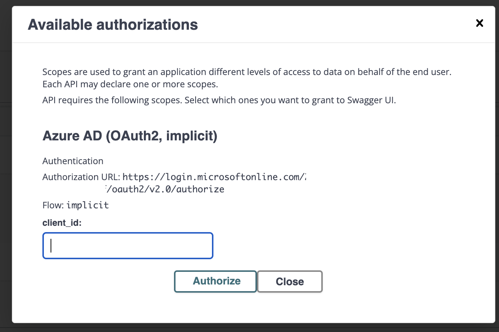
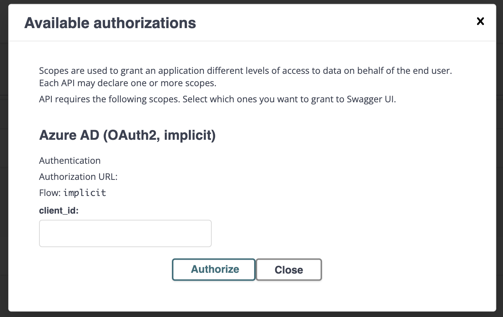

# implicit-issue

## The problem

We are using Azure AD to authenticate users. We are using the Oauth2 implicit flow.

I'd like to allow users to use the Swagger UI to authenticate to test APIs. When I run the app as a jar, it works
as expected:

But when I compile the app natively, some of the configuration is ignored, specifically `quarkus.smallrye-openapi.oauth2-implicit-authorization-url`:

Even if I set that configuration with an environment variable, it does not work.

## My environment:

openjdk 22.0.2 2024-07-16
OpenJDK Runtime Environment GraalVM CE 22.0.2+9.1 (build 22.0.2+9-jvmci-b01)
OpenJDK 64-Bit Server VM GraalVM CE 22.0.2+9.1 (build 22.0.2+9-jvmci-b01, mixed mode, sharing)

## Java Dev Build

The CLIENT_ID and TENANT_ID are actually UUIDs from Azure.

CLIENT_ID=54321 TENANT_ID=12345 ./gradlew quarkusDev

## Native build

./gradlew clean build -x test -Dquarkus.native.enabled=true -Dquarkus.package.jar.enabled=false

CLIENT_ID=54321 TENANT_ID=212345 ./build/implicit-issue-1.0.0-SNAPSHOT-runner
